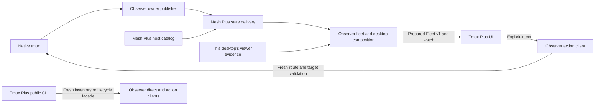

# Tmux Plus

Source candidate, 2026-10-10: Tmux Plus **0.12.0a5** pins the complete
Tmux Observer **0.6.0a5** package. The candidate includes the reviewed refresh
scope and Mesh bridge retirement fixes. Artifact validation and coordinated
adoption are separate from the deployed selection below.

Coordinated transport selection, 2026-10-10: Mesh 0.1.0a9, Tmux Observer
0.6.0a4 and Tmux Plus 0.12.0a4 are deployed on Snap and Starship. Agent's
a13 reader and a12 bridge use new private a9 environments; its a15 collector
and a16 writer retain their prior artifacts. The frozen networking contracts
are unchanged. [Exact gates and limits](https://github.com/byebyebryan/mesh-plus/blob/main/docs/evidence/2026-10-10-fleet-adoption/README.md)
keep source, packaged, installed and operational acceptance distinct.

A Rofi picker and public CLI for local and remote tmux sessions.
Browse sessions, reopen the last useful context, focus or attach with Open,
and use guarded Kill confirmation. Tmux Plus remains useful for manual tmux
management; Agent Plus consumes its generic CLI without adding provider policy here.

## Current selection

As recorded on **2026-10-10**, Snap and Starship select **Tmux Plus 0.12.0a4**,
**Tmux Observer 0.6.0a4** and **Mesh Plus 0.1.0a9**.

The [Mesh selection guide](docs/mesh-integration.md) and
[accepted catalog-fix record](https://github.com/byebyebryan/tmux-observer/blob/main/docs/evidence/2026-10-10-catalog-bound-fix/README.md)
bind the exact packages, headless/native checks, resource/capacity limits and
managed recovery/paired rollback. The
[managed operations ledger](https://github.com/byebyebryan/tmux-observer/blob/main/docs/managed-operations.md)
owns installed selection. Earlier graphical acceptance keeps its original
artifact and endpoint scope; graphical presentation/input and physical suspend
were optional and unrun for these Mesh wiring releases.

## Browse sessions

| Key | Behavior |
| --- | --- |
| Up / Down | Select a row |
| Left / Right | Cycle views, preserving the filter |
| Tab / Shift+Tab | Cycle Open and Kill |
| Enter | Open, or begin Kill confirmation |
| Alt+R | Request bounded passive refresh |
| Escape / Ctrl+G | Close the picker |
| Ctrl+B / Ctrl+F | Move the text cursor |

The view ring is **Open → Attached → All → Local → configured remote hosts**.
Without remotes, All and Local collapse to Local. Empty and unavailable
configured hosts retain their place in the ring.

| View | Meaning |
| --- | --- |
| Open | Fresh confirmed or qualified viewer presence on this desktop |
| Attached | Fresh positive tmux client counts, including clients on other desktops |
| All / Local / host | Session inventory, with retained unavailable rows marked explicitly |

`open here?` is qualified display evidence. Open and Attached supply no verified
close handle or provider lifecycle authority. Unknown membership remains explicit;
use All or Local to inspect sessions excluded from a filtered view.

Each new dialog starts with an empty filter and Open selected. The launcher
restores the remembered view and last successfully opened complete session
reference once at startup. Later updates preserve the current selection.
Kill confirmation freezes its exact target and starts on Cancel.

See the [product and interaction guide](docs/DESIGN.md) for row states, freshness,
selection, confirmation and failure behavior.

## Components



Mesh owns reusable state networking. Observer owns passive native facts,
source receipts, desktop associations and prepared composition. Its separate
action package owns native lifecycle, terminal launch and window actions.
Tmux Plus owns presentation and user intent. Explicit refresh remains a bounded
Observer control path; fresh inventory and actions use independent validated paths.

The picker reads prepared local views and watch updates. Startup and browsing
start no service and perform no tmux, SSH or desktop collection. A missing or
incompatible prepared reader is a visible failure. See
[component boundaries](docs/observer-boundaries.md) and
[Observer runtime architecture](https://github.com/byebyebryan/tmux-observer/blob/main/docs/runtime-architecture.md).

## Use the public CLI

With the installed public command:

```sh
rofi-tmux-plus inventory --json
rofi-tmux-plus inventory --json --with-viewers
```

Inventory is an explicit fresh operation. The optional viewer extension reports
this caller's `open`, `none` or `unknown` evidence without changing owner facts
or providing action handles. The public CLI also exposes `open`, `create`,
`rename`, `kill`, `viewers` and `close-viewer`; their exact argv, guards and
JSON are defined by [Tmux Session v1](docs/TMUX_SESSION_V1.md).

Remote fresh inventory and lifecycle routes consume Host Mesh v1 through the
public SSH Plus command. They target the default tmux server, preserve complete
identities and independently validate actions. Prepared Mesh reads are a separate
interface; an outage never silently changes a cached read into fresh collection.

## Launch the picker

Use the accepted Observer installation, running prepared services and packaged
native mode for the supported Rofi binary. The source launcher invocation is:

```sh
./bin/rofi-tmux-plus-rofi -show tmux-plus -modes tmux-plus \
  -kb-custom-1 Alt+r -kb-custom-2 Right -kb-custom-3 Left \
  -kb-custom-7 Tab -kb-custom-8 ISO_Left_Tab \
  -kb-element-next "" -kb-element-prev "" \
  -kb-accept-custom "" -kb-delete-entry "" \
  -kb-cancel Escape,Control+g \
  -kb-move-char-forward Control+f -kb-move-char-back Control+b \
  -eh 2
```

The launcher verifies the native mode and Rofi binary tuple, prepares the initial
selection and owns its watch/process cleanup. Unsupported or drifted integration
produces a bounded error display. Package installation and service startup are
separate operational steps.

For checkout setup and the source gate, use [development](docs/development.md).
The [documentation index](docs/README.md) links current contracts, configuration,
selection and historical release evidence.
